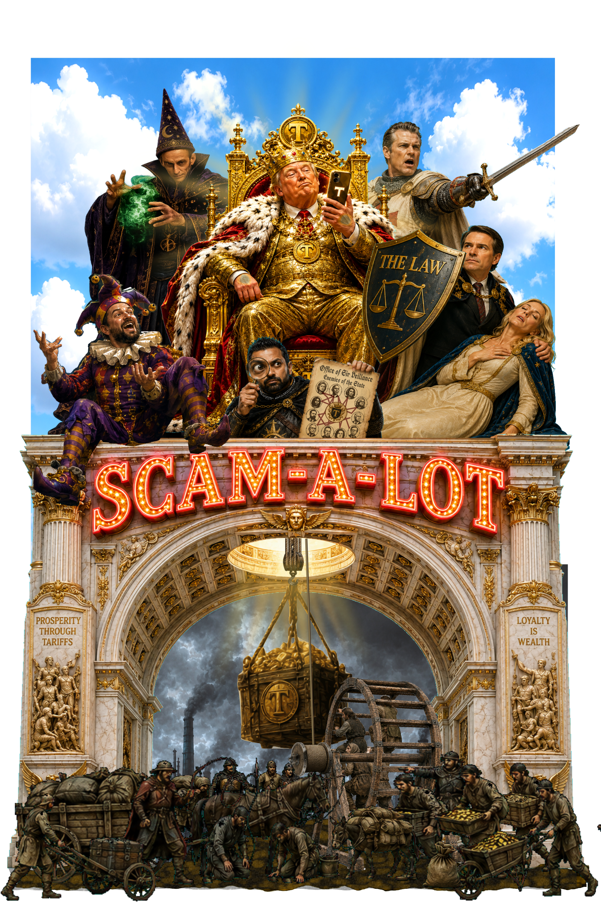

# Scam-A-Lot

A satirical political musical production and ecosystem about propaganda, loneliness, media ecosystems, and the battle for reality.

## Listen
* [Scam-A-Lot Song List](https://rmhorton.github.io/Scam-A-Lot)
* [Radio Free Scam-A-Lot](https://rmhorton.github.io/Scam-A-Lot/docs/index.html?config=radio_show.js) audio play
* [The Royal Hour](https://rmhorton.github.io/Scam-A-Lot/docs/index.html?config=royal_hour.js) audio play (in progress)
* [Advertisement Library](https://rmhorton.github.io/Scam-A-Lot/docs/index.html?config=ads.js)

## Overview

In the kingdom of Scam-A-Lot, reality itself has become media spectacle. The state-media system sells outrage, certainty, nationalism, masculinity branding, billionaire worship, endless war, propaganda, and emotional simplification. There is resistance.

The project combines political satire and musical theater. The long-term goal is eventual adaptation into protest performance art, theatrical productions, etc. But we are starting with something simpler...

## Radio Free Scam-A-Lot

[Radio Free Scam-A-Lot](https://rmhorton.github.io/Scam-A-Lot/docs/index.html?config=radio_show.js) is an audio-first “radio play” designed to be easily produced and adapted. The program is a playlist composed of songs, radio segments, commercials, propaganda announcements, and pirate interruptions. This format is designed to be modular, expandable, collaborative, and rapidly adaptable. New songs and segments can be added continuously as political events evolve and new thematic material emerges. It can also be published on conventional music platforms.

The context is a conflict between:
* an authoritarian state-media network, and
* a pirate-radio resistance broadcast known as _Radio Free Scam-A-Lot_.

The story revolves around the evolving relationship between:

 - *Dave*: An emotionally insecure state-media DJ slowly realizing the system he defends may be hollow.
 - *Flower*: A pirate-radio broadcaster whose resistance evolves from ideological righteousness toward deeper empathy and emotional understanding.

## How to Get the Songs

You can play the songs (and read the lyrics to sing along!) on the [Scam-A-Lot Song List](https://rmhorton.github.io/Scam-A-Lot) page.

To download all of the MP3 files, click the green "Code" button at the top right of the repository [main page](https://github.com/rmhorton/Scam-A-Lot/) and select "Download Zip"; that will give you a copy of the entire repository. The MP3s are in the folder named "audio". You can also download the audio files one at a time through the github web interface, but it is easier to just get the whole zip file.

## AI-Assisted Creative Workflow

This project makes extensive use of AI-assisted creative tools for brainstorming, lyric development, musical prototyping, visual design, interface development, voice acting, and rapid experimentation. It intentionally explores how modern AI systems can accelerate and expand independent creative production.

## Status

Active early development. Songs, scripts, characters, and structure are evolving rapidly.

Watch this space for updates on our social media debut.

